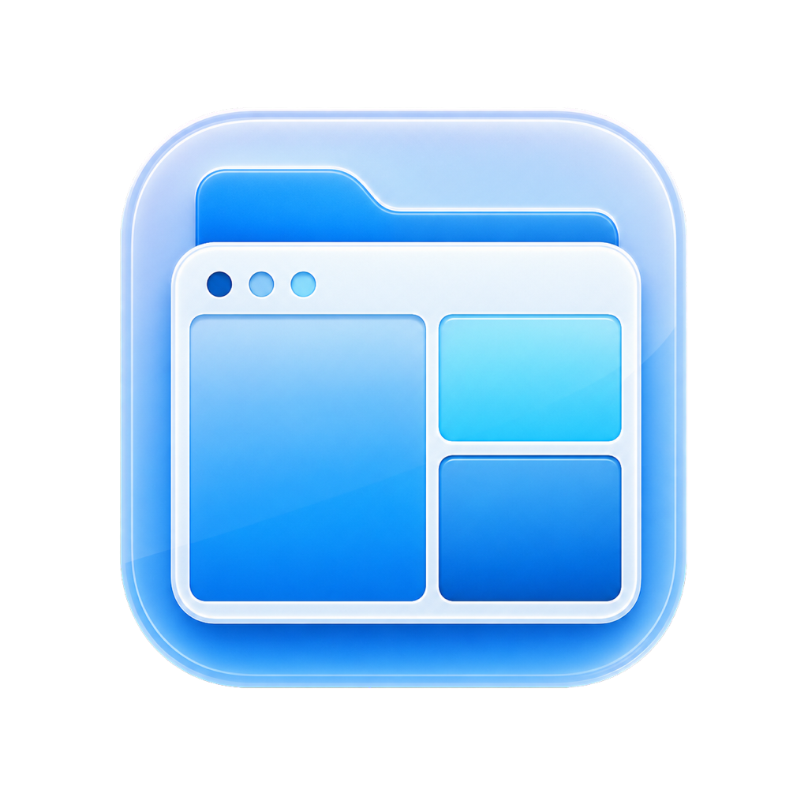

# Finder v2.0

<p align="center">
  
</p>

一個免費、開源、原生 macOS 多視窗檔案管理 App。可以在同一個畫面開兩個、三個或四個資料夾，直接拖放檔案。

> Finder v2.0 是獨立開源專案，不會取代 Apple Finder，亦與 Apple Inc. 無關。

## 下載及安裝

1. 到 [Releases](../../releases/latest) 下載最新的 `Finder-v2.0-macOS.dmg`。
2. 打開 DMG。
3. 將 `Finder v2.0` 拖入 `Applications`。
4. 第一次打開時，請右擊 App，再按「開啟」。

需要 macOS 14 Sonoma 或更新版本。支援 Apple Silicon 及 Intel Mac。

由於這個免費版本未使用 Apple Developer ID 公證，第一次打開時 macOS 可能會顯示安全提示。

## 主要功能

- 左右雙開、上下雙開、三開及四開版面。
- 每一格可獨立開啟本機、iCloud、Google Drive 或外置硬碟。
- 正常拖放會搬移；按住 `Option` 拖放會複製。
- 多選、即時更新、縮圖、清單、大圖示、直欄及圖庫顯示。
- 新增資料夾、改名、搬去垃圾桶、ZIP 壓縮及解壓。
- 撞名時可取消、取代或保留兩個。
- `Command-Z` 還原搬檔、改名及新增資料夾。
- 搜尋、排序、收藏、顯示隱藏檔案、左右比較及同步。
- 記住上次版面及每一格的位置。

## 常用快捷鍵

- `Command-Shift-N`：新增資料夾
- `Command-Delete`：搬去垃圾桶
- `Command-Z`：還原
- `Space`：快速預覽

第一次使用「下載」、「文件」、iCloud 或 Google Drive 時，按工具列的資料夾按鈕，再按「使用這個資料夾」。macOS 確認一次後會自動記住。

## 自行建立

需要 macOS 14 或更新版本，以及 Xcode Command Line Tools。

```sh
./scripts/build-app.sh
```

建立 DMG：

```sh
./scripts/make-dmg.sh
```

執行測試：

```sh
swift test
```

## 私隱

Finder v2.0 沒有帳戶、分析追蹤或網絡伺服器，不會上載或收集任何檔案。

## 授權

[MIT License](LICENSE)

---

## English

Finder v2.0 is a free, open-source, native macOS multi-pane file manager. It supports two, three, or four folder panes in one window, drag-and-drop move/copy, thumbnails, search, undo, cloud folders, external drives, and more.

Download the latest DMG from [Releases](../../releases/latest). Requires macOS 14 Sonoma or later and supports both Apple Silicon and Intel Macs. This independent project is not affiliated with Apple Inc.
